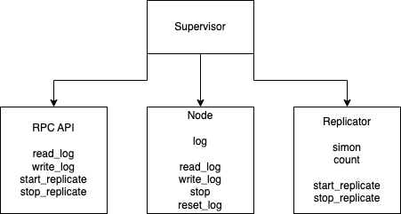

# Simon

Simon is a primitive distributed system that replicates data between nodes. The user decides which nodes will replicate. The user writes data to a node, and replicating nodes poll the data from that node. Each node has RPC API that has following commands:

- read_log: reads n values from node log at index i
- write_log: writes a batch of data to log
- start_replicate: starts replicating from a node x
- stop_replicate: stops replicating from whatever node it was replicating



## Tests

```
mix test
```

## Usage

```
# build binary
mix release

# run node A 
env RELEASE_DISTRIBUTION=name RELEASE_NODE=aaa@127.0.0.1 SIMON_PORT=9000 _build/dev/rel/sim/bin/sim start

# read node A log, should be empty
curl http://localhost:9000/read_log?idx=0 && echo

# write an entry to node A log
curl -X PUT http://localhost:9000/write_log -H 'Content-Type: application/json' -d '{"msg":["two", "three"]}' && echo

# read node A log, should have the entries we've just added
curl http://localhost:9000/read_log?idx=0 && echo

# run node B
env RELEASE_DISTRIBUTION=name RELEASE_NODE=bbb@127.0.0.1 SIMON_PORT=9001 _build/dev/rel/sim/bin/sim start

# read node B log, should be empty
curl http://localhost:9001/read_log?idx=0 && echo

# tell node B to start replicating from node A
curl -X PUT http://localhost:9001/start_replicate -H 'Content-Type: application/json' -d '{"node":"aaa@127.0.0.1"}' && echo

# read node B log, should have the entries of node A
curl http://localhost:9001/read_log?idx=0 && echo
``````
